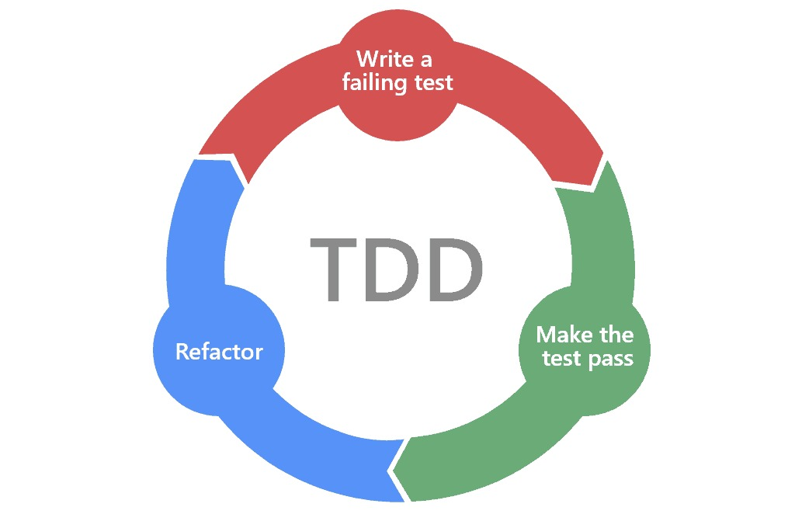

# TDD: Intervalos

## Autores:

- Hugo Vázqued Docampo
- Rodrigo de la Calle Alonso

### Versión 1:

En esta iteración se partirá de la versión inicial del código cogida del repositorio de GitHub:
`commit`: 3953db82 on 13/5/20 at 00:18

#### 🛑 Rojo:
- Se realizará el test de `getMin()`.

#### ✅ Verde:

- Se codificará el método `getMin()`.

#### 🔁 Refactor:

- Se renombrarán tanto la variable `min`como el método `getMin()`por `minimo` y `getMinimo()` respectivamente.
- Se corregirán también los errores en los test.

### Versión 2:

#### 🛑 Rojo:

- Se realizará el test de `getMax()`.

#### ✅ Verde:

- Se codificará el método `getMax()`.
-
#### 🔁 Refactor:

- Se renombrarán tanto la variable `max`como el método `getMax()`por `maximo` y `getMaximo()` respectivamente.
- Se corregirán también los errores en los test.

### Versión 3:

#### 🛑 Rojo:

- Se realizarán los test de la clase `Extremo`

#### ✅ Verde:

- Se  definirá la clase `Extremo` con los métodos `getValor()`, `getIncluido()`.

#### 🔁 Refactor:

- Se reestructurará la clase `Intervalo` para que se pueda instanciar con objetos de la clase `Extremo`.
- Se adaptan los métodos `getMinimo()` y `getMaximo()` para que devuelvan objetos de la clase `Extremo`.
- Se borra el método `include()` para que la responsabilidad de saber si un punto está dentro de un intervalo sea de la clase `Extremo`.
- Se adaptan los test para que funcionen con la nueva estructura.

### Versión 4:

#### 🛑 Rojo:

- Se define el test de `hayInterseccion()` que devuelva `true` si dos intervalos tienen algún punto en común.

#### ✅ Verde:

- Se  implementa el método `hayInterseccion()`: si los intervalos tienen algún punto en común, devolverá `true`.

#### 🔁 Refactor:

- Se adaptan los test para que funcionen con la nueva estructura.
- Se refactoriza el método `hayIntersección()` para solucionar el code smell de `variables y checkeos redundantes`.

### Versión 5:

#### Version Final:

- En el paquete `entrega` de los paquetes `main` y `test` se encuentra la versión final del código tras 
haber aplicado los pasos de TDD.